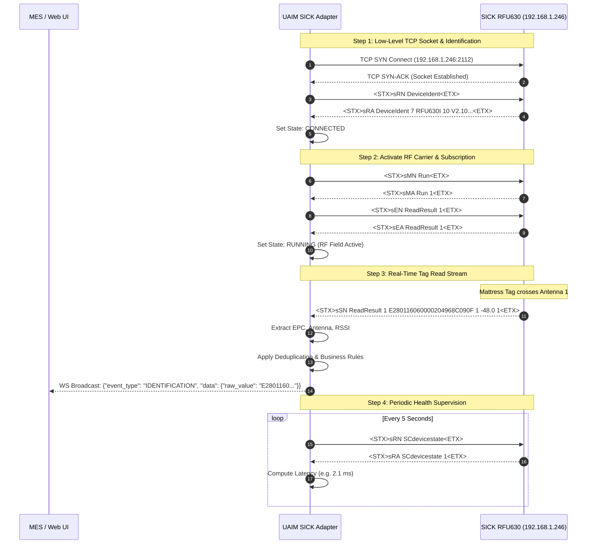
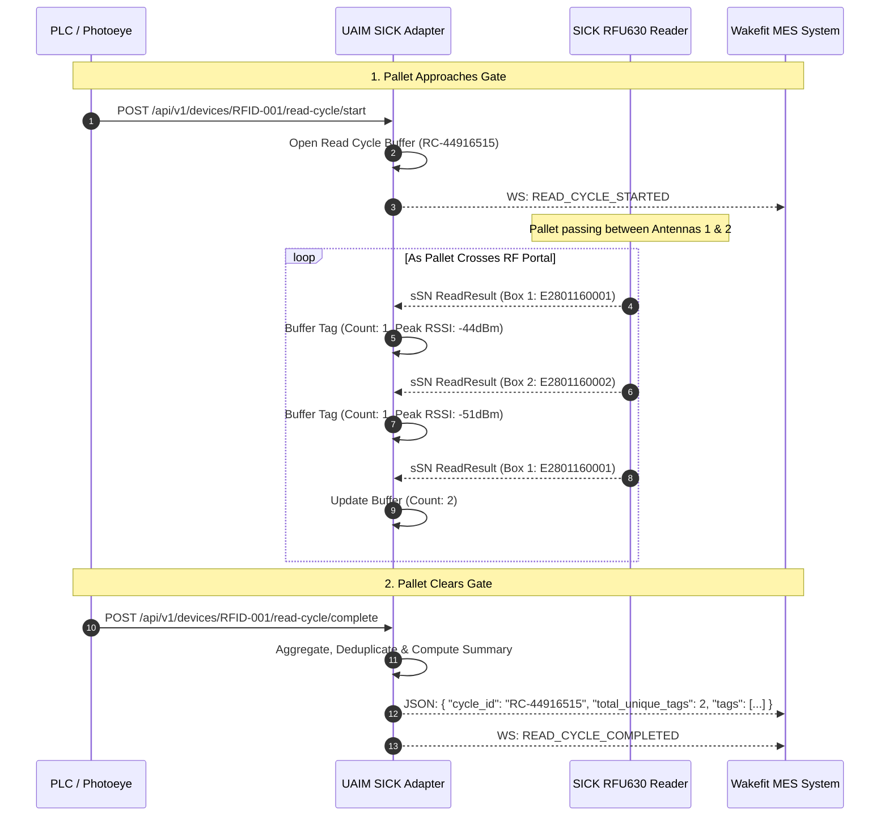

# SICK RFU63x Series Fixed RFID Reader: Comprehensive Technical & Integration Guide

**Device Reference:** SICK RFU630 / RFU620 / RFU650 Industrial Fixed UHF RFID Reader  
**Hardware ID / Model:** `ARS38UHFKRFF1` / `RFU630-13100`  
**Application Target:** Wakefit Finished Goods (FG) Pallet Gates, Conveyor Portals & Label Verification Systems  
**Module Name:** `uaim_device.adapters.sick_rfu630`  

---

## 1. Executive Summary & Hardware Overview

The **SICK RFU63x series** (including RFU620, RFU630, and RFU650) is a ruggedized industrial UHF RFID interrogator compliant with **EPCglobal Class 1 Gen 2 / ISO/IEC 18000-6C**. It is engineered for industrial identification scenarios requiring high-speed reading, multi-tag collision resolution, and long-range detection (up to 10 meters).

In the Wakefit FG Label Generation and Warehouse Tracking architecture, the SICK RFU630 functions as a **Fixed Portal / Gate Reader** deployed at packing lines and pallet shipping gates to verify tagged mattresses, furniture, and boxed products as they pass through checkpoints.

```
                                  SICK RFU630 Industrial Reader
                                 ┌──────────────────────────────┐
  Pallet / Finished Goods        │  Antenna 1 (Internal/Ext)    │
  =======================        │  Antenna 2 (External)        │
  [📦 EPC: E2801160...] ───────► │  Antenna 3 (External)        │
  [📦 EPC: E2801161...]          │  Antenna 4 (External)        │
  [📦 EPC: E2801162...]          └──────────────┬───────────────┘
                                                │
                                    Industrial Ethernet (M12)
                                       IPv4: 192.168.1.246
                                       TCP Host Port: 2112
                                                │
                                                ▼
                                 ┌──────────────────────────────┐
                                 │   UAIM SICK Device Adapter   │
                                 │    (Python / FastAPI Engine) │
                                 └──────────────┬───────────────┘
                                                │
                        ┌───────────────────────┴───────────────────────┐
                        │                                               │
                        ▼                                               ▼
             Real-Time WebSocket Stream                        REST API Endpoints
           `ws://localhost:8000/ws/events`                 `http://localhost:8000/api/v1/`
          (Live Tag Detection Broadcast)                 (Pallet Read Cycles, Control, Health)
```

### 1.1 Technical Hardware Specifications

| Specification | Parameter / Value |
| :--- | :--- |
| **Air Interface Protocol** | EPCglobal UHF Class 1 Gen 2 / ISO/IEC 18000-6C |
| **Operating Frequency** | 865.6 MHz – 867.6 MHz (ETSI / Europe / India) / 902 – 928 MHz (FCC / US) |
| **Antenna Configuration** | Integrated circularly polarized antenna + up to 3 external antenna ports (TNC reverse) |
| **RF Output Power** | Adjustable from 10 dBm to 30 dBm (up to 2 Watts ERP) |
| **Reading Range** | Up to 5 m (integrated antenna) / Up to 10 m (with external high-gain antennas) |
| **Enclosure Rating** | IP67 (dust-tight and protected against water immersion) |
| **Supply Voltage** | 18 V DC … 30 V DC (Typical: 24 V DC, Class 2 power supply) |
| **Power Consumption** | Max 20 W (with all external antennas energized at full transmit power) |
| **Communication Ports** | 10/100 MBit/s Ethernet (M12 4-pin D-coded), RS-232/RS-422, CAN bus, USB Service |
| **Digital I/O** | 2 physical inputs (Sensors / Photoeyes) + 2 physical outputs (Stack lights, Diverters) |

### 1.2 Physical Connector Pinouts

```
   M12 Ethernet (4-Pin D-Coded)             M12 Power / Serial (17-Pin A-Coded)
          ┌───────┐                                     ┌───────┐
       2  │ O   O │  1  (1=TX+, 2=RX+)               ●   │ O O O │   ●  (Pin 1=VCC +24V DC)
       3  │ O   O │  4  (3=TX-, 4=RX-)             ●   ● │ O O O │ ●   ●(Pin 2=GND 0V)
          └───────┘                                  ●   │ O O O │   ●  (Pins=Sensors & Outputs)
                                                        └───────┘
```

---

## 2. Network Topologies & IP Configuration

The UAIM Adapter connects to the SICK RFU630 over standard IPv4 TCP/IP socket connections.

### 2.1 Factory Default vs. Wakefit Production Network Settings

| Network Parameter | Factory Default Setting | Wakefit Pallet Gate Setting |
| :--- | :--- | :--- |
| **Reader IP Address** | `192.168.0.1` | **`192.168.1.246`** |
| **Subnet Mask** | `255.255.255.0` | **`255.255.255.0`** |
| **Default Gateway** | `0.0.0.0` | **`0.0.0.0`** (or factory router IP) |
| **Host PC Static IP** | `192.168.0.100` | **`192.168.1.100`** (must be on same `192.168.1.x` subnet) |
| **SOPAS ASCII Port** | `2111` | `2111` |
| **Ethernet Host Port** | `2112` | **`2112`** |

### 2.2 Host PC Network Interface Configuration (Windows)

To ensure uninterrupted TCP connectivity between the host PC and the SICK RFU630 reader:

1. Open **Network Connections** (`ncpa.cpl` in Windows).
2. Right-click the dedicated Ethernet NIC connected to the RFID switch/reader and select **Properties**.
3. Select **Internet Protocol Version 4 (TCP/IPv4)** and click **Properties**.
4. Configure a static IP address:
   - **IP Address:** `192.168.1.100`
   - **Subnet Mask:** `255.255.255.0`
   - **Default Gateway:** `192.168.1.1` (or leave empty if local isolated switch)
5. Test link reachability in PowerShell:
   ```powershell
   ping 192.168.1.246
   Test-NetConnection -ComputerName 192.168.1.246 -Port 2112
   ```

---

## 3. SICK SOPAS ET Device Configuration Guide

Before the Python adapter can read tags, the physical SICK reader must be configured using **SICK SOPAS ET (Engineering Tool)**.

```
┌─────────────────────────────────────────────────────────────────────────────┐
│                            SOPAS ET Configuration                           │
├───────────────────────┬──────────────────────────┬──────────────────────────┤
│ 1. Network Settings   │ 2. Reading Diagnosis     │ 3. Object Trigger Mode   │
│ IP: 192.168.1.246     │ Antenna 1: ENABLED       │ Mode: CONTINUOUS / AUTO  │
│ Subnet: 255.255.255.0 │ TX Power: >= 20.0 dBm    │ (RF Field stays active)  │
│ Port: 2112 (Host)     │ Polarization: Circular   │ SICK Heartbeat: Enabled  │
└───────────────────────┴──────────────────────────┴──────────────────────────┘
```

### 3.1 Step-by-Step SOPAS Setup Checklist

1. **Connect to Reader**:
   - Open **SOPAS ET**.
   - Search for connected devices. SICK RFU630 (`ARS38UHFKRFF1`) will appear under IP `192.168.1.246`.
   - Log in with User Level: **Authorized Client** (Default password: `client` or `SICKsensor`).

2. **Ethernet Host Port Settings**:
   - Navigate to: **Interfaces > Ethernet > Host Interface**.
   - Protocol: **CoLa-A** or **Data Output (Format 1)**.
   - Socket Role: **TCP Server**.
   - Port: **`2112`** (or `2111`).
   - Frame Control: Start character `<STX>` (`0x02`), End character `<ETX>` (`0x03`) or Newline (`\r\n`).

3. **Antenna & RF Transmit Power**:
   - Navigate to: **RFID Configuration > Antennas**.
   - **Antenna 1 (Internal):** Checked / Enabled.
   - **Transmit Power:** Set to at least **20.0 dBm** (up to 27.0 - 30.0 dBm for maximum range on pallet gates).
   - If external antennas are plugged into ports 2, 3, or 4, enable them accordingly.

4. **Object Trigger Mode (CRITICAL)**:
   - Navigate to: **Object Trigger / Reading Gate**.
   - Set Trigger Source to: **Continuous / Free Running / Auto Read**.
   - *Note:* If Trigger Source is accidentally set to "Digital Input 1 (Hardware Photoeye)" without an active 24V sensor connected, the reader's RF carrier will remain completely turned off, and no tags will ever be detected. Setting it to **Continuous** ensures the RF field is energized whenever `sMN Run` is active.

5. **Data Output Format (Output Format 1)**:
   - Navigate to: **Data Processing > Output Format**.
   - Format: Standard semicolon or CSV output (e.g. `1;<EPC>;<RSSI>;<Count>`).
   - Ensure hardware heartbeat is enabled (emits `1;HeartBeat;` every 5 seconds).

6. **Save Configuration to Flash Memory**:
   - Click **Permanent Parameterization (Store to Flash / EEPROM)** to ensure settings persist across power cuts.

---

## 4. SICK CoLa-A (Command Language ASCII) Protocol Specification

The SICK RFU630 uses **CoLa-A** (Command Language ASCII), a human-readable, request-response and asynchronous event protocol transmitted over TCP sockets.

### 4.1 Byte-Level Telegram Framing

Every standard CoLa-A telegram is framed between two control bytes:
- **`<STX>`** = Hex `0x02` (ASCII Start of Text)
- **`<ETX>`** = Hex `0x03` (ASCII End of Text)

```
┌──────┬──────────────────────────────────────────────────────────────────┬──────┐
│ STX  │                       CoLa-A ASCII Body                          │ ETX  │
│ 0x02 │ <TelegramType><Space><CommandName><Space>[Arguments/Data...]      │ 0x03 │
└──────┴──────────────────────────────────────────────────────────────────┴──────┘
```

> **Dual-Mode Framing Support in UAIM Adapter:**  
> SICK devices configured with custom Output Formats often stream tag reads and heartbeats terminated by `\r\n` or semicolons without `<STX>/<ETX>` wrapping. The UAIM `ColaFrameDecoder` implements a dual-mode streaming buffer that automatically decodes both `<STX>...<ETX>` blocks and line-delimited streams (`\r\n`, `;`) without packet loss.

### 4.2 Telegram Types Breakdown

| Prefix | Name | Direction | Function |
| :--- | :--- | :--- | :--- |
| **`sRN`** | **Read Variable Request** | Host ➔ Reader | Queries an internal parameter, device state, or serial number. |
| **`sRA`** | **Read Variable Answer** | Reader ➔ Host | Returns the requested parameter value. |
| **`sWN`** | **Write Variable Request** | Host ➔ Reader | Updates a parameter or configuration value. |
| **`sWA`** | **Write Variable Answer** | Reader ➔ Host | Confirms successful parameter update. |
| **`sMN`** | **Method Invocation Request**| Host ➔ Reader | Triggers an internal hardware action (e.g., start scan, reboot). |
| **`sMA` / `sAN`**| **Method Answer** | Reader ➔ Host | Confirms execution status of the requested method. |
| **`sEN`** | **Event Subscription Request**| Host ➔ Reader | Enables or disables an asynchronous event notification stream. |
| **`sEA`** | **Event Subscription Answer** | Reader ➔ Host | Confirms event subscription state. |
| **`sSN`** | **Async Event Notification** | Reader ➔ Host | **Spontaneous real-time scan event** emitted when tags are read. |
| **`sFA`** | **Fault / Error Response** | Reader ➔ Host | Emitted when a command is rejected, unrecognized, or invalid. |

### 4.3 Standard SICK Fault / Error Codes (`sFA`)

When a command fails, the reader responds with `<STX>sFA <ErrorCode><ETX>`:

| Fault Code | Status Name | Description / Root Cause |
| :--- | :--- | :--- |
| **`0001`** | **Unknown Command / Variable** | Method name or variable does not exist in this firmware. |
| **`0002`** | **Access Denied** | Insufficient user permission (requires SOPAS login / password). |
| **`0003`** | **Parameter Error** | Argument count or value range is out of bounds. |
| **`0004`** | **Device Busy** | Reader is currently busy processing an internal flash write. |
| **`0005`** | **Operational Mode Error** | Method cannot be executed in the current device operating mode. |
| **`F`** | **Generic Fault** | Hardware or interface error. |

---

## 5. Complete SICK CoLa-A Command Reference Matrix

Below is the definitive reference table of commands used by the UAIM adapter to manage, query, and stream from the SICK RFU630:

```
┌────────────────────────────────────────────────────────────────────────────────────────────────────────┐
│                                    SICK RFU630 CoLa Command Set                                        │
├────────────────────┬────────────────┬──────────────────────────────────────────┬───────────────────────┤
│ Command String     │ Type           │ Purpose & Function                       │ Example Response      │
├────────────────────┼────────────────┼──────────────────────────────────────────┼───────────────────────┤
│ sRN DeviceIdent    │ Read Variable  │ Queries device model & firmware revision │ sRA DeviceIdent 7 RFU │
│ sRN SCdevicestate  │ Read Variable  │ Health heartbeat query (1=OK, 0=Fault)   │ sRA SCdevicestate 1   │
│ sRN LocationName   │ Read Variable  │ Queries user station / location name     │ sRA LocationName RFP  │
│ sMN Run            │ Method Invoke  │ Activates RF transmitter & tag reading   │ sMA Run 1             │
│ sMN Freeze         │ Method Invoke  │ Pauses RF transmitter (standby mode)     │ sMA Freeze 1          │
│ sMN TAwriteTagData │ Method Invoke  │ Encodes EPC/UII or data into RFID tag    │ sAN TAwriteTagData 0 0│
│ sMN TAextWriteTagData│ Method Invoke│ Extended RFID tag memory write           │ sAN TAextWriteTagData 0│
│ sEN ReadResult 1   │ Subscribe Event│ Subscribes to tag scan event stream      │ sEA ReadResult 1      │
│ sEN ReadResult 0   │ Unsubscribe    │ Unsubscribes from tag scan event stream  │ sEA ReadResult 0      │
│ sEN RFIOpData 1    │ Subscribe Event│ Subscribes to auxiliary RFID telemetry   │ sEA RFIOpData 1       │
│ sMN SetAccessMode 3│ Method Invoke  │ Elevates session to Authorized Client    │ sMA SetAccessMode 1   │
└────────────────────┴────────────────┴──────────────────────────────────────────┴───────────────────────┘
```

### Detailed Command Examples

#### 1. Device Identification Handshake (`sRN DeviceIdent`)
- **Sent by Adapter:** `\x02sRN DeviceIdent\x03`
- **Returned by SICK:** `\x02sRA DeviceIdent 7 RFU630I 10 V2.10-28.07.2019\x03`
- **Extracted Info:** Vendor: `SICK`, Model: `RFU630I`, Firmware: `V2.10-28.07.2019`.

#### 2. Start RF Scanning Loop (`sMN Run`)
- **Sent by Adapter:** `\x02sMN Run\x03`
- **Returned by SICK:** `\x02sMA Run 1\x03` or `\x02sAN Run 1\x03`
- **Action:** Powers on UHF RF carrier wave on enabled antenna channels.

#### 3. Stop RF Scanning Loop (`sMN Freeze`)
- **Sent by Adapter:** `\x02sMN Freeze\x03`
- **Returned by SICK:** `\x02sMA Freeze 1\x03`
- **Action:** Powers down UHF RF carrier wave to prevent RF bleed when idle.

#### 4. Periodic Heartbeat Probe (`sRN SCdevicestate`)
- **Sent by Adapter:** `\x02sRN SCdevicestate\x03`
- **Returned by SICK:** `\x02sRA SCdevicestate 1\x03`
- **Action:** Verifies hardware state and computes round-trip latency in milliseconds.

#### 5. Encode / Write EPC to RFID Tag (`sMN TAextWriteTagData`)
- **Sent by Adapter (Non-addressed):** `\x02sMN TAextWriteTagData 0 0 1 2 6 32 +24 E2801190A504006FA2BF55AB 1\x03`
- **Sent by Adapter (Addressed):** `\x02sMN TAextWriteTagData 2 +24 <TargetEPC> 1 2 6 32 +24 <NewEPC> 1\x03`
- **Returned by SICK (Success):** `\x02sAN TAextWriteTagData 0 6\x03` (or `sAN TAextWriteTagData 1 6` for addressed mode, where `6` = words written)
- **Action:** Encodes 96-bit (24-hex characters = 6 words) EPC `E2801190A504006FA2BF55AB` into Bank 1 (EPC/UII) starting at word offset 2 with 32 retries on Antenna 1.

---

## 6. Real-Time Tag Parsing & Normalization Pipeline

The UAIM Adapter includes a resilient, multi-format parser (`uaim_device/adapters/sick_rfu630/parser.py`) capable of decoding all standard SICK telegram formats into clean, normalized business models.

```
                    ┌──────────────────────────────────────────────┐
                    │  Raw Ingested Frame (Socket / Host Port)     │
                    └──────────────────────┬───────────────────────┘
                                           │
                                           ▼
                    ┌──────────────────────────────────────────────┐
                    │        Heartbeat & Ping Filter               │
                    │   Detects '1;HeartBeat;' ➔ Updates Latency   │
                    └──────────────────────┬───────────────────────┘
                                           │ (Non-Heartbeat Data)
                                           ▼
         ┌─────────────────────────────────┼─────────────────────────────────┐
         │                                 │                                 │
         ▼                                 ▼                                 ▼
┌──────────────────┐             ┌──────────────────┐              ┌──────────────────┐
│  SOPAS 4-Tuple   │             │ Semicolon / CSV  │              │ Raw Hex EPC      │
│  sSN ReadResult  │             │ 1;E2801160...;   │              │ E280116060000204 │
│  1 <EPC> 1 -48.0 │             │ -48.0;1          │              │ 968C090F         │
└────────┬─────────┘             └────────┬─────────┘              └────────┬─────────┘
         │                                │                                 │
         └────────────────────────────────┼─────────────────────────────────┘
                                          │
                                          ▼
                         ┌──────────────────────────────────┐
                         │         RFIDTag Model            │
                         │  - epc: "E280116060000204968C..."│
                         │  - antenna_id: 1                 │
                         │  - rssi_dbm: -48.0               │
                         │  - read_count: 1                 │
                         │  - timestamp: ISO 8601 UTC       │
                         └────────────────┬─────────────────┘
                                          │
                                          ▼
                         ┌──────────────────────────────────┐
                         │   EventNormalizer & Deduplicator │
                         │  - Strips/Appends Prefixes       │
                         │  - Enforces EPC Mask Filter      │
                         │  - Enforces Min RSSI Threshold   │
                         │  - Deduplicates in Sliding Window│
                         └────────────────┬─────────────────┘
                                          │
                                          ▼
                         ┌──────────────────────────────────┐
                         │   Normalized IdentificationEvent │
                         │  (Emitted to WS & Read Cycles)   │
                         └──────────────────────────────────┘
```

### 6.1 Supported Ingestion Formats

1. **SOPAS Positional 4-Tuple Telegrams**:
   ```
   sSN ReadResult 1 E280116060000204968C090F 1 -48.0 1
   ```
   - Parameter 1: `1` (Tag Count)
   - Parameter 2: `E280116060000204968C090F` (EPC Identifier)
   - Parameter 3: `1` (Physical Antenna Channel ID)
   - Parameter 4: `-48.0` (RSSI in dBm)
   - Parameter 5: `1` (Read count / hit rate)

2. **SICK Output Format 1 (Semicolon Stream)**:
   ```
   1;E280116060000204968C090F;-48.0;1
   ```
   - Segment 1: Header / Group ID (`1`)
   - Segment 2: 24-character EPC Hex String (`E280116060000204968C090F`)
   - Segment 3: Signal Strength / RSSI (`-48.0`)
   - Segment 4: Antenna / Tag Counter (`1`)

3. **Comma-Delimited CSV Stream**:
   ```
   E280116060000204968C090F,1,-48.0
   ```

4. **Key-Value Formatted Output**:
   ```
   sSN ReadResult EPC=E280116060000204968C090F;ANT=1;RSSI=-45.5;TID=E2801105
   ```

5. **Direct Raw Hex EPC Stream**:
   ```
   E280116060000204968C090F
   ```
   - Automatically matched using Regex `^[0-9A-Fa-f]{8,128}$`.

---

## 7. Configuration Settings (`config.yaml`)

The SICK RFU630 adapter configuration is maintained declaratively in `config.yaml`:

```yaml
devices:
  - device_id: RFID-001
    name: Pallet Gate SICK RFU630
    type: RFID_FIXED
    adapter: sick_rfu630
    vendor: SICK
    model: RFU630
    connection_type: ETHERNET
    host: 192.168.1.246               # Static IP of the physical SICK reader
    port: 2112                        # SICK Ethernet Host Port (CoLa-A)
    station_id: PALLET-GATE-01        # Logical tracking station location
    enabled: true                     # Auto-loaded by DeviceManager on startup
    
    # Operation Mode: AUTOSCAN (Continuous) vs EVENT_BASED (Hardware Gate Trigger)
    fixed_mode: AUTOSCAN

    # Formatting, Masking & Signal Quality Filters
    formatting:
      format_mode: HEX_CLEAN          # HEX_CLEAN: Upper-case alphanumeric hex
      prefix: ""                      # Business prefix (e.g. "MATTRESS-")
      suffix: ""                      # Business suffix
      strip_prefix: ""                # Strip leading vendor markers
      epc_filter_prefix: ""           # EPC Mask filter (e.g. "E280" or empty for all tags)
      min_rssi_dbm: null              # Minimum signal filter (e.g. -75.0 to ignore stray tags)
      target_antennas: [1, 2, 3, 4]   # Active physical antenna channels

    # Resilient Auto-Reconnection Supervisor
    reconnect:
      enabled: true
      initial_delay: 1.0              # Starts retrying after 1 second
      max_delay: 30.0                 # Exponential backoff capped at 30 seconds
      backoff_factor: 2.0             # 1s -> 2s -> 4s -> 8s -> 16s -> 30s
      jitter: true                    # +/- 20% randomized jitter to avoid reconnect storms

    # Sliding Window Deduplication
    deduplication:
      enabled: true
      window_ms: 500                  # Suppresses duplicate reads within 500 ms

    # Low-Level Protocol Configuration
    configuration:
      auto_start_on_connect: true     # Automatically sends 'sMN Run' upon TCP connection
      enable_heartbeat: true          # Sends periodic 'sRN SCdevicestate' probes
      heartbeat_interval_sec: 5.0     # Heartbeat interval in seconds
      raw_logging: true               # Logs incoming raw CoLa frames for commissioning
```

---

## 8. Interaction Sequence Diagrams

### 8.1 Connection Handshake & Real-Time Reading Flow



### 8.2 Synchronized Pallet Gate Read Cycle Flow



---

## 9. Comprehensive REST API & WebSocket Reference

The UAIM device server exposes high-level HTTP REST and WebSocket APIs on port `8000`.

### 9.1 Device Health & Status

#### `GET /api/v1/devices/RFID-001/health`
Returns connection state, hardware metadata, latency, and read metrics.

**PowerShell Example:**
```powershell
Invoke-RestMethod -Uri "http://localhost:8000/api/v1/devices/RFID-001/health" -Method Get | ConvertTo-Json -Depth 5
```

**Response Payload:**
```json
{
  "device_id": "RFID-001",
  "name": "Pallet Gate SICK RFU630",
  "status": "HEALTHY",
  "state": "RUNNING",
  "connection_type": "ETHERNET",
  "host": "192.168.1.246",
  "port": 2112,
  "latency_ms": 2.4,
  "total_events": 1420,
  "total_errors": 0,
  "last_event_time": "2026-09-10T11:45:12.184Z",
  "metadata": {
    "firmware": "V2.10-28.07.2019",
    "vendor": "SICK",
    "model": "RFU630"
  }
}
```

---

### 9.2 Real-Time Pallet Gate Read Cycles

#### `POST /api/v1/devices/RFID-001/read-cycle/start`
Opens a synchronized read cycle window to accumulate tags passing a pallet gate.

**PowerShell Example:**
```powershell
Invoke-RestMethod -Uri "http://localhost:8000/api/v1/devices/RFID-001/read-cycle/start" -Method Post | ConvertTo-Json -Depth 5
```

**Response Payload:**
```json
{
  "status": "ok",
  "read_cycle": {
    "cycle_id": "RC-44916515",
    "device_id": "RFID-001",
    "station_id": "PALLET-GATE-01",
    "started_at": "2026-09-10T11:46:00.120Z",
    "status": "OPEN",
    "total_unique_tags": 0,
    "total_observations": 0,
    "tags": []
  }
}
```

#### `POST /api/v1/devices/RFID-001/read-cycle/complete`
Closes the read cycle window, aggregates all tags read during the interval, and returns the pallet manifest.

**PowerShell Example:**
```powershell
Invoke-RestMethod -Uri "http://localhost:8000/api/v1/devices/RFID-001/read-cycle/complete" -Method Post | ConvertTo-Json -Depth 5
```

**Response Payload:**
```json
{
  "status": "ok",
  "summary": {
    "event_id": "EVT-DB3F07873B43",
    "cycle_id": "RC-44916515",
    "device_id": "RFID-001",
    "station_id": "PALLET-GATE-01",
    "started_at": "2026-09-10T11:46:00.120Z",
    "ended_at": "2026-09-10T11:46:08.450Z",
    "duration_ms": 8330,
    "total_unique_tags": 3,
    "total_observations": 42,
    "tags": [
      {
        "epc": "E280116060000204968C090F",
        "antenna_id": 1,
        "rssi_dbm": -46.5,
        "read_count": 18,
        "first_seen": "2026-09-10T11:46:01.200Z",
        "last_seen": "2026-09-10T11:46:07.800Z"
      },
      {
        "epc": "E280116060000204968C091A",
        "antenna_id": 1,
        "rssi_dbm": -49.0,
        "read_count": 15,
        "first_seen": "2026-09-10T11:46:01.500Z",
        "last_seen": "2026-09-10T11:46:07.600Z"
      },
      {
        "epc": "E280116060000204968C092B",
        "antenna_id": 2,
        "rssi_dbm": -53.2,
        "read_count": 9,
        "first_seen": "2026-09-10T11:46:02.100Z",
        "last_seen": "2026-09-10T11:46:06.900Z"
      }
    ]
  }
}
```

---

### 9.3 Transponder Memory Encoding & Writing (EPC/UII)

#### `POST /api/v1/devices/RFID-001/tag/write`
Writes a new EPC/UII hex identifier or memory bank payload to an RFID transponder in the RF field.

**Memory Bank Architecture (EPC Class 1 Gen 2):**
- **Bank 1 (EPC/UII):** Word `0` = CRC-16, Word `1` = PC (Protocol Control word), Word `2..N` = EPC data (starts at word offset 2).
- **Standard 96-Bit EPC:** 24 hexadecimal characters = 12 bytes = 6 words.
- **Addressing Modes:**
  - **Non-Addressed Mode (`target_epc: null`):** Encodes whichever transponder is currently within the antenna's RF field.
  - **Addressed Mode (`target_epc: "..."`):** Targets only the specific transponder matching the current EPC (prevents accidental overwriting when multiple tags are present).

**Request Parameters:**
| Parameter | Type | Required | Description | Example |
| :--- | :--- | :--- | :--- | :--- |
| `epc` | `string` | **Yes** | New EPC hex value to write | `"E2801190A504006FA2BF55AB"` |
| `target_epc`| `string` | No | Current EPC for addressed write | `"E280116060000204968C090F"` |
| `memory_bank`| `integer`| No | Memory bank (1=EPC, 3=User, 0=Reserved) | `1` |
| `word_offset`| `integer`| No | Starting word offset in memory bank | `2` |
| `retries` | `integer`| No | Hardware RF retry count | `32` |
| `antenna_id` | `integer`| No | Target physical antenna channel (1-4) | `1` |

**PowerShell Example:**
```powershell
$body = @{
    epc = "E2801190A504006FA2BF55AB"
    memory_bank = 1
    word_offset = 2
    retries = 32
} | ConvertTo-Json

Invoke-RestMethod -Uri "http://localhost:8000/api/v1/devices/RFID-001/tag/write" `
                  -Method Post `
                  -Body $body `
                  -ContentType "application/json" | ConvertTo-Json -Depth 5
```

**Python Client Example:**
```python
import requests

payload = {
    "epc": "E2801190A504006FA2BF55AB",
    "target_epc": None,  # Non-addressed mode
    "memory_bank": 1,
    "word_offset": 2,
    "retries": 32
}
response = requests.post("http://localhost:8000/api/v1/devices/RFID-001/tag/write", json=payload)
print(response.json())
```

**Success Response Payload:**
```json
{
  "success": true,
  "device_id": "RFID-001",
  "epc": "E2801190A504006FA2BF55AB",
  "target_epc": null,
  "memory_bank": 1,
  "word_offset": 2,
  "word_count": 6,
  "words_written": 6,
  "status_code": "0",
  "status_message": "Success (6 words / 96 bits written and verified on transponder)",
  "command_sent": "sMN TAextWriteTagData 0 0 1 2 6 32 +24 E2801190A504006FA2BF55AB 1",
  "raw_response": "sAN TAextWriteTagData 0 6",
  "latency_ms": 398.84,
  "timestamp": "2026-09-10T12:31:07.006295+00:00"
}
```

**SICK RFU630 Write Response Codes:**
| Words Written (`tokens[1]`) | Result | Description / Meaning |
| :--- | :--- | :--- |
| **`>= 6` (Word Count)** | **Success** | Tag EPC successfully written to silicon memory and verified by reader. |
| **`0`** | **Failure** | Transponder not detected in RF field, target EPC mismatch, weak RF signal, or memory locked. |

---

### 9.4 Manual CoLa Command Execution

#### `POST /api/v1/devices/RFID-001/command`
Sends arbitrary raw CoLa-A commands directly to the physical SICK reader for diagnostic testing.

**PowerShell Example:**
```powershell
$body = @{ command = "sRN DeviceIdent" } | ConvertTo-Json
Invoke-RestMethod -Uri "http://localhost:8000/api/v1/devices/RFID-001/command" -Method Post -Body $body -ContentType "application/json"
```

**Response Payload:**
```json
{
  "status": "ok",
  "command": "sRN DeviceIdent",
  "response": "sRA DeviceIdent 7 RFU630I 10 V2.10-28.07.2019"
}
```

---

### 9.5 Real-Time WebSocket Event Stream

Connect to `ws://localhost:8000/ws/events` using any standard WebSocket client (JavaScript `new WebSocket(...)`, Python `websockets`, or Postman).

**Live Tag Identification Event:**
```json
{
  "event_type": "IDENTIFICATION",
  "timestamp": "2026-09-10T11:47:03.412Z",
  "device_id": "RFID-001",
  "station_id": "PALLET-GATE-01",
  "event_id": "EVT-A109827B",
  "data": {
    "raw_value": "E280116060000204968C090F",
    "normalized_value": "E280116060000204968C090F",
    "tag_type": "RFID_EPC",
    "antenna_id": 1,
    "rssi_dbm": -47.5,
    "read_count": 1
  }
}
```

---

## 10. Field Commissioning & Troubleshooting Guide

### 10.1 Step-by-Step Commissioning Checklist

```
[ ] 1. Power Supply: Verify reader's M12 power cable has 24V DC (LED PWR is solid green).
[ ] 2. Ethernet Link: Verify Ethernet LED (LNK/ACT) is flashing green/orange on RJ45/M12 port.
[ ] 3. Network Ping: Host PC `ping 192.168.1.246` responds with < 5ms.
[ ] 4. Port Check: `Test-NetConnection -ComputerName 192.168.1.246 -Port 2112` returns `TcpTestSucceeded: True`.
[ ] 5. SOPAS Trigger: Confirm Object Trigger is set to "Continuous / Free Running" in SOPAS ET.
[ ] 6. Antenna Power: Confirm Antenna 1 is enabled with Transmit Power >= 20 dBm.
[ ] 7. Application Launch: Start UAIM Adapter (`python -m uaim_device.main`).
[ ] 8. Verify State: Health API confirms `state: "RUNNING"`.
[ ] 9. Physical Tag Test: Wave an EPC Gen2 tag in front of Antenna 1; observe immediate WebSocket stream & console logs.
```

### 10.2 Troubleshooting Matrix

| Symptom | Probable Cause | Corrective Action |
| :--- | :--- | :--- |
| **Ping fails / Request timed out** | Incorrect Host PC IP or bad Ethernet patch cable. | Set Host PC Static IP to `192.168.1.100` (`255.255.255.0`). Check M12 Ethernet cabling. |
| **Ping works, but Port 2112 fails** | SICK Ethernet Host Port disabled or set to different port. | Open SOPAS ET, navigate to **Interfaces > Ethernet**, ensure Host Port is set to `2112` and TCP Server mode is active. |
| **Connected, but no tags read when placed near antenna** | 1. SOPAS Object Trigger set to "Hardware DI" instead of Continuous.<br>2. Transmit Power is 0 dBm or Antenna 1 disabled.<br>3. Reader is in `Freeze` mode. | 1. In SOPAS ET, change **Object Trigger** to **Continuous / Free Running**.<br>2. Enable Antenna 1 and set Power to $\ge 20\text{ dBm}$.<br>3. Send `POST /api/v1/devices/RFID-001/start` to trigger `sMN Run`. |
| **Tags read intermittently / weak signal** | Antenna polarization mismatch or metal/water shielding. | Orient tag parallel to antenna face. Elevate transmit power to 27 dBm. Check for metal pallet frames blocking RF path. |
| **Duplicate tag reads flooded** | Deduplication window too small in `config.yaml`. | Increase `deduplication.window_ms` to `1000` or `2000` in `config.yaml`. |
| **Stray tags from adjacent aisles detected** | Transmit power too high or lack of RSSI filter. | Lower transmit power in SOPAS ET or configure `formatting.min_rssi_dbm: -65.0` in `config.yaml` to filter distant reflections. |
| **`sFA 0001` returned on command** | Command syntax unsupported by this firmware. | Verify command spelling against Section 5 table. Use `sRN DeviceIdent` for verification. |

---

## 11. Useful PowerShell Operational Scripts

### 11.1 Check Health & Latency
```powershell
Invoke-RestMethod -Uri "http://localhost:8000/api/v1/devices/RFID-001/health" | Format-List
```

### 11.2 Start Pallet Read Cycle, Wait 5 Seconds, and Complete
```powershell
Write-Host "Starting Pallet Read Cycle..." -ForegroundColor Cyan
$start = Invoke-RestMethod -Uri "http://localhost:8000/api/v1/devices/RFID-001/read-cycle/start" -Method Post
$cycleId = $start.read_cycle.cycle_id
Write-Host "Opened Cycle: $cycleId. Accumulating tags for 5 seconds..." -ForegroundColor Green

Start-Sleep -Seconds 5

Write-Host "Closing Pallet Read Cycle..." -ForegroundColor Cyan
$summary = Invoke-RestMethod -Uri "http://localhost:8000/api/v1/devices/RFID-001/read-cycle/complete" -Method Post
Write-Host "Cycle Completed! Summary:" -ForegroundColor Yellow
$summary.summary | ConvertTo-Json -Depth 5
```

### 11.3 Stream WebSocket Events Directly in PowerShell
```powershell
$ws = New-Object System.Net.WebSockets.ClientWebSocket
$cts = New-Object System.Threading.CancellationTokenSource
$uri = New-Object System.Uri("ws://localhost:8000/ws/events")
$connectTask = $ws.ConnectAsync($uri, $cts.Token)
$connectTask.Wait()

Write-Host "Connected to Live Event Stream (Ctrl+C to stop)..." -ForegroundColor Green
$buffer = New-Object byte[] 4096

while ($ws.State -eq 'Open') {
    $segment = New-Object System.ArraySegment[byte] -ArgumentList @(,$buffer)
    $receiveTask = $ws.ReceiveAsync($segment, $cts.Token)
    $receiveTask.Wait()
    $count = $receiveTask.Result.Count
    $jsonString = [System.Text.Encoding]::UTF8.GetString($buffer, 0, $count)
    Write-Host $jsonString -ForegroundColor Cyan
}
```

### 11.4 Write / Encode EPC to RFID Tag via PowerShell
```powershell
$epcToWrite = "E2801190A504006FA2BF55AB"

$payload = [Ordered]@{
    epc = $epcToWrite
    memory_bank = 1
    word_offset = 2
    retries = 32
} | ConvertTo-Json

Write-Host "Encoding EPC '$epcToWrite' to transponder in RF field..." -ForegroundColor Cyan

$response = Invoke-RestMethod -Uri "http://localhost:8000/api/v1/devices/RFID-001/tag/write" `
                              -Method Post `
                              -Body $payload `
                              -ContentType "application/json"

if ($response.success) {
    Write-Host "✅ Tag Written Successfully in $($response.latency_ms) ms!" -ForegroundColor Green
    Write-Host "   New EPC: $($response.epc)" -ForegroundColor Yellow
    Write-Host "   Command Sent: $($response.command_sent)" -ForegroundColor DarkGray
    Write-Host "   Raw SICK Response: $($response.raw_response)" -ForegroundColor DarkGray
} else {
    Write-Host "❌ Tag Write Failed: $($response.status_message)" -ForegroundColor Red
}
```

---

*Document Version:* 1.0  
*Maintained by:* Wakefit Automation & Integration Team (UAIM)  
*Related Documentation:* [`EXPLAINER.md`](file:///d:/UAIM/Projects/Wakefit/FGLabelGenerationSystem/Connectionadapter/EXPLAINER.md), [`README.md`](file:///d:/UAIM/Projects/Wakefit/FGLabelGenerationSystem/Connectionadapter/README.md)
